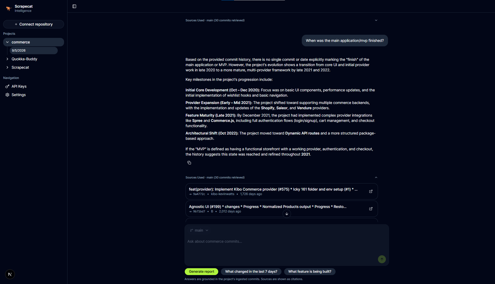

<p align="center">
  
</p>

<br>

## 🐈 Scrapecat — RAG Chat Over Git History

Scrapecat is an engineering intelligence assistant that answers questions about your repository's history. It uses RAG (Retrieval-Augmented Generation) to find the most relevant commits and summarizes them at a feature level — no more digging through git logs or writing manual reports. Built because a CEO kept asking what engineering was doing **daily** when everything was on Git.

## Tech Stack
- **Backend:** Fastify 5 (Node.js), Drizzle ORM + PostgreSQL (pgvector)
- **Frontend:** Next.js 16 (React 19), TanStack React Query, Tailwind CSS v4, shadcn/ui + AI Elements
- **Data Source:** Native GitHub REST via `Octokit`, local git archive for commit ingestion
- **Intelligence:** OpenRouter API (Google Gemma 4, DeepSeek, GPT-4o, etc.)
- **Package Manager:** pnpm workspaces

## Core Features

- **RAG Chat:** Ask questions about your code history in natural language. The system retrieves the most relevant commits via vector search (pgvector HNSW index) and summarizes them using an LLM.
- **Feature-Level Summaries:** Related commits are grouped by feature, bug fix, refactor, or infrastructure — no individual commit listing unless asked.
- **Importance Reranking:** Commits are scored by conventional commit type (`feat!`, `feat`, `fix!`, `breaking`), file count, and PR merges. The most important 30 commits are surfaced.
- **Report Artifacts:** Ask for a "report" or "summary" and the LLM wraps the output in a `:::report` block, rendered as a styled card in the chat.
- **Source Citations:** Every AI response includes a collapsible "Sources Used" section with direct links to GitHub commits.
- **Project Tree Sidebar:** Connected repositories with nested chat sessions, branch selector, and navigation.
- **Copy Support:** One-click copy of AI responses (report markers stripped automatically).

## Future Roadmap
- **External Integrations:** Connect Slack, Linear, Jira, and Notion so reports cross-reference commits with tickets, messages, and docs.
- **Git Adapters:** Pluggable adapters for any git source — GitLab, BitBucket, self-hosted instances, and beyond.
- **Persona-Driven Synthesis:** Custom tone mapping to generate reports specifically tailored for CTOs, Founders, or Board Members.
- **Enterprise-Grade Security:** Implementing E2E Encryption, SSO, and Organization-level RBAC (Role-Based Access Control).

AI is increasing commit velocity, not reducing it. Scrapecat is the missing layer that translates engineering output into something every department can actually understand.

## Getting Started

### 1. GitHub API Configuration

Scrapecat requires a Personal Access Token (PAT) to fetch repository metadata and commit history.

- 1.  Navigate to [GitHub Settings](https://github.com/settings) > Developer Settings > Personal Access Tokens.
- 2.  Ensure the `repo` (Full control of private repositories) and `read:org` scopes are enabled.
- 3. Scrapecat treats your data as read-only. We analyze the metadata to build reports without ever modifying your source code.

### 2. OpenRouter Intelligence Layer

We use OpenRouter's API for LLM access. The free tier works out of the box.

- 1. Sign up at [OpenRouter](https://openrouter.ai/keys) and create a free API key.
- 2. Default model: `google/gemma-4-31b-it` — supports chat, summaries, and report artifacts.

## Environment Setup

```bash
cp backend/.env.example backend/.env
```

Required values in `backend/.env`:

| Variable | Description |
|---|---|
| `OPENROUTER_API_KEY` | LLM access — get a free key at [openrouter.ai/keys](https://openrouter.ai/keys) |
| `GITHUB_TOKEN` | Repository data access — create one at [github.com/settings/tokens](https://github.com/settings/tokens) |

## Local Deployment

```bash
# Install dependencies
pnpm install

# Generate database migration
pnpm run db:generate

# Apply migrations (creates projects, commit_chunks, chat_sessions, credentials tables)
pnpm run db:migrate

# Start the development server
pnpm run dev
```

The application will be live at http://localhost:3000. Connect your first repository and start asking questions about your code history.

## Docker Setup

### Prerequisites
- [Docker](https://docs.docker.com/get-docker/) and [Docker Compose](https://docs.docker.com/compose/install/)

### Development (hot reload)

```bash
docker compose up --build
```

Three services start:
- **Postgres (pgvector)** at http://localhost:5432 — persisted via a named volume
- **Backend** (Fastify) at http://localhost:4000 — auto-reloads via `tsx watch`
- **Frontend** (Next.js) at http://localhost:3000 — HMR via `next dev`

### Stop

```bash
docker compose down
```

## Architecture

### RAG Pipeline

1. **Query parsing** — natural language date windows are parsed ("last 30 days", "since June", "2024") and applied as metadata filters
2. **Vector search** — 200 candidate commits retrieved via pgvector HNSW index
3. **Importance reranking** — candidates scored by conventional commit type, file count, and PR merge status; top 30 returned
4. **LLM summarization** — system prompt instructs the LLM to group by feature, not list individual commits
5. **Report artifacts** — when the user asks for a report, the LLM wraps output in `:::report` for special card rendering
6. **Sources** — every response includes a collapsible "Sources Used" section with commit links

### Key Backend Modules

| Module | Purpose |
|---|---|
| `src/chat/` | Chat sessions, streaming, RAG retrieval, AI integration |
| `src/chat/ai.ts` | `callAI()` — unified LLM interface (OpenRouter + OpenAI-compatible) |
| `src/chat/retrieval.ts` | Vector search + importance reranking |
| `src/chat/date-window.ts` | Natural language date parsing for temporal queries |
| `src/projects/` | Project/repository management, commit ingestion, embeddings |
| `src/repositories/` | Local git archive, commit reading, ingestion orchestrator |
| `src/credentials/` | Encrypted API key storage (AES-256-GCM) |

## Contributing

We welcome contributions from engineers who understand that documentation is as important as code.

- **Bug Reports:** Open an issue with a clear reproduction script and environment details.
- **Feature Requests:** Focused on scalability, retrieval accuracy, and developer autonomy.

## License

This project is licensed under the MIT License.

---

Scrapecat | Built for the builders.
_Engineered by Francisco Luna_